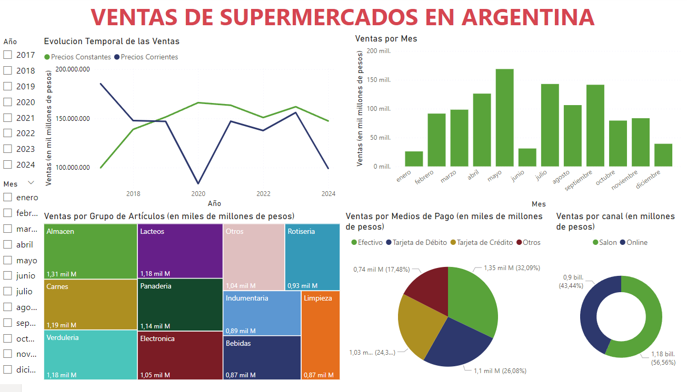
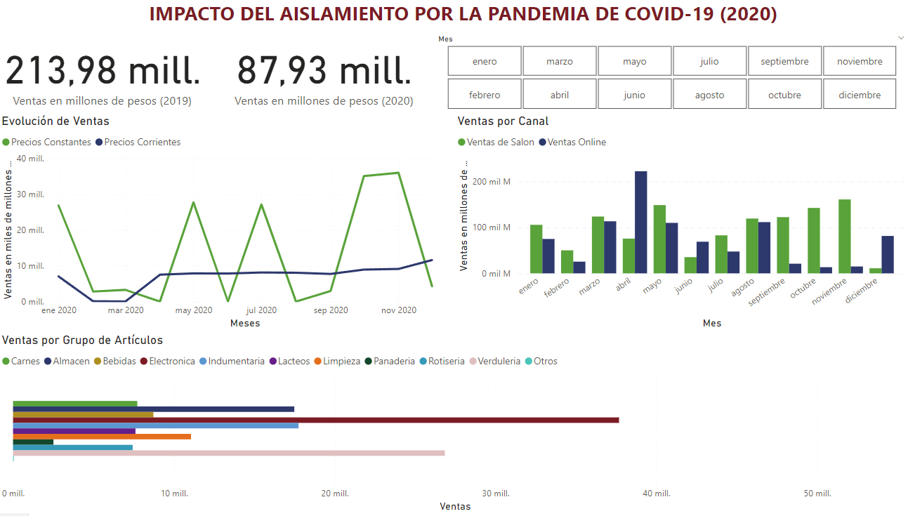
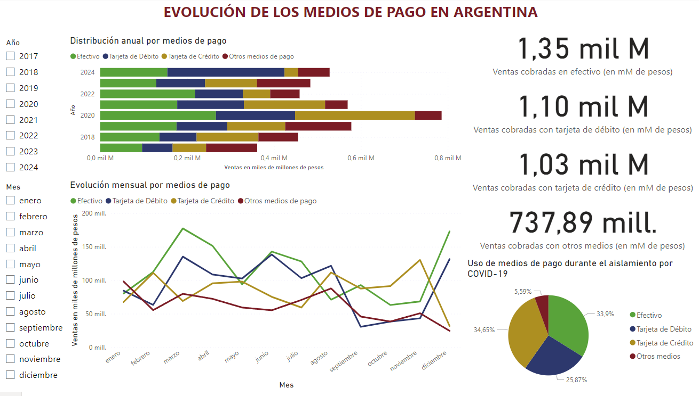
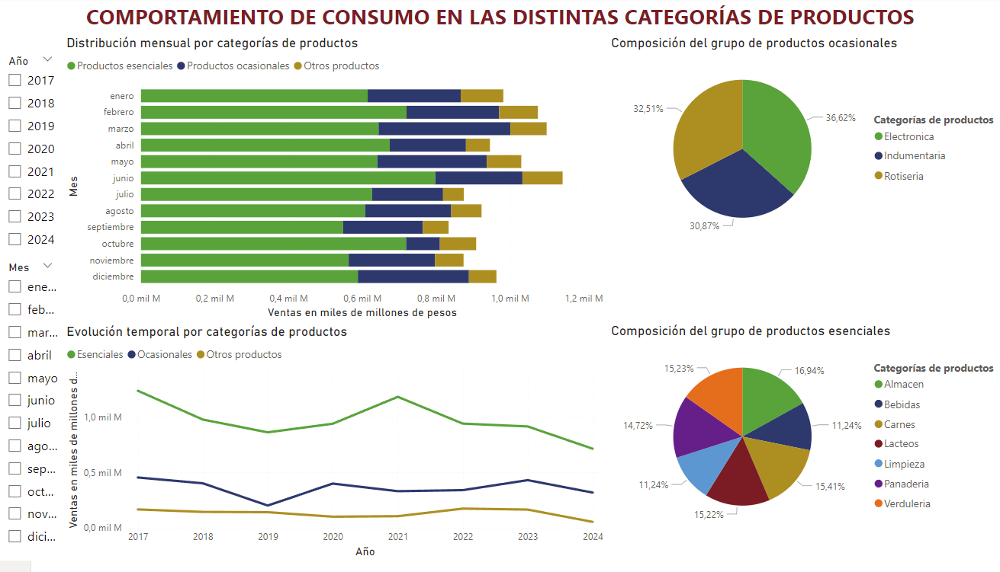

# **Análisis de Ventas de Supermercados en Argentina**

## **Descripción del Proyecto**
Este proyecto explora un dataset de ventas mensuales de supermercados en Argentina, con datos que abarcan desde 2017 hasta el mes de Agosto de 2024. Se analizan tendencias generales, impacto de la pandemia, distribución por categorías de productos y preferencias de medios de pago, utilizando Power BI.

El objetivo es presentar insights clave sobre el comportamiento de las ventas, destacar patrones relevantes y comunicar hallazgos de manera clara y visual a través de dashboards interactivos.

---

## **Contenido**
1. [Contexto del Proyecto](#contexto-del-proyecto)
2. [Objetivos](#objetivos)
3. [Herramientas Utilizadas](#herramientas-utilizadas)
4. [Estructura del Proyecto](#estructura-del-proyecto)
5. [Análisis Realizado e Insights](#análisis-realizado-e-insights)

---

## **Contexto del Proyecto**
Este proyecto utiliza datos abiertos del sitio [Datos Argentina](https://datos.gob.ar/) para analizar las ventas totales de supermercados a valores corrientes y constantes, desglosadas por:
- Grupos de productos 
- Canales de venta 
- Medios de pago 

---

## **Objetivos**
1. **General**: Extraer insights relevantes sobre las ventas de supermercados en Argentina.
2. **Específicos**:
   - Analizar la evolución de las ventas totales (corrientes y constantes).
   - Identificar categorías de productos con mayor impacto.
   - Evaluar el impacto de la pandemia en las ventas y preferencias de los consumidores.
   - Comunicar hallazgos mediante dashboards interactivos.

---

## **Herramientas Utilizadas**
- **Power BI**: Visualización de datos y creación de dashboards.
- **DAX**: Creación de métricas y cálculos en Power BI.

---

## **Estructura del Proyecto**
1. **Limpieza y Exploración de Datos**:
   - Durante el desarrollo del proyecto, se identificó que algunas columnas del dataset contenían valores en notación científica debido a su magnitud. Esto afectaba la legibilidad de los gráficos y la comprensión de los insights. Para solucionar este problema, se crearon métricas personalizadas en DAX en Power BI. Estas métricas permitieron redondear y formatear los datos de manera clara y comprensible para el usuario final.
2. **Dashboards**:
   - **Resumen General**: Ventas totales y desglosadas desde 2017 a Agosto de 2024.
   - **Impacto de la Pandemia**: Detalle de ventas durante el año 2020.
   - **Medios de Pago**: Evolución de las preferencias de pago de los consumidores.
   - **Análisis por Categorías**: Agrupación por consumo esencial, ocasional u otros.

---

## **Análisis Realizado e Insights**
1. **Resumen General**:
   
2. **Impacto de la Pandemia**:
   
3. **Medios de Pago**:
   
4. **Categorías de Productos**:
   
